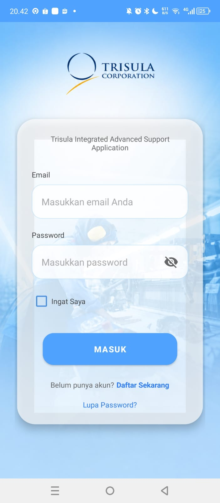
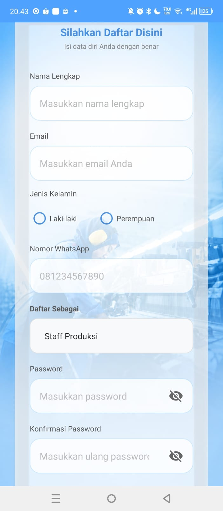
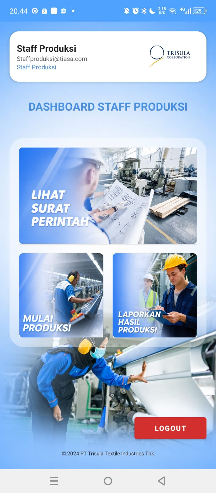
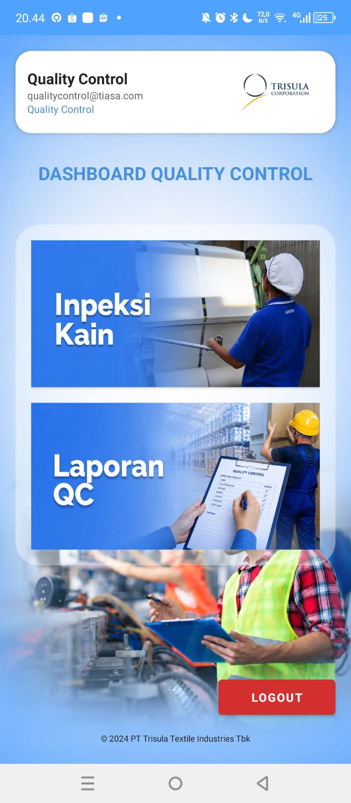
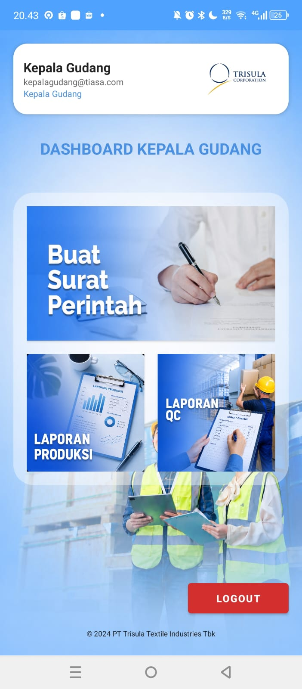
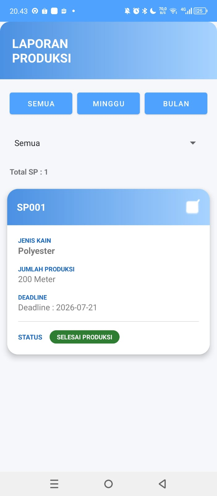
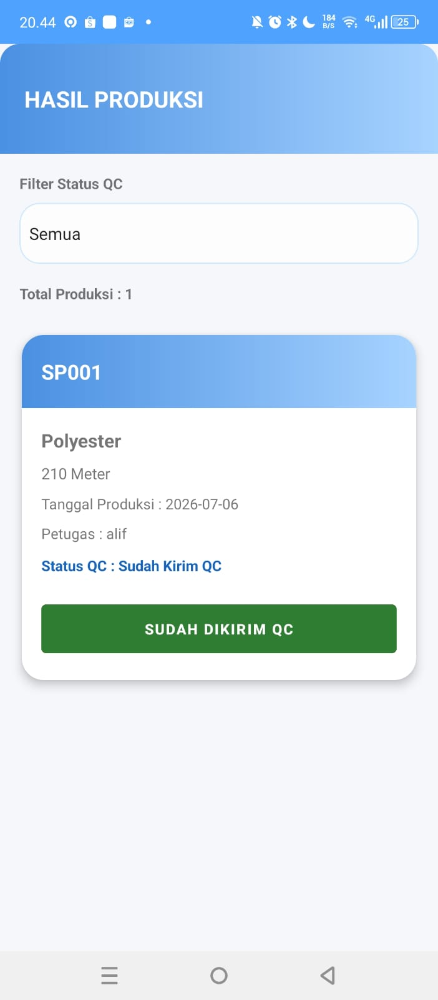
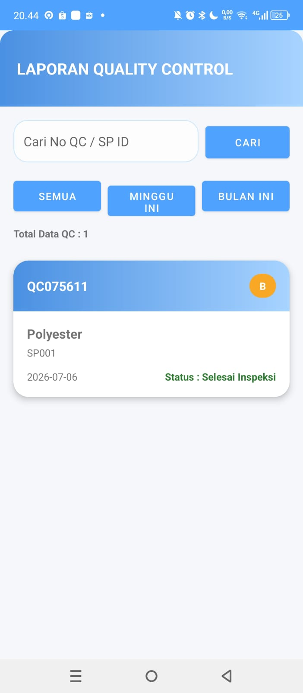
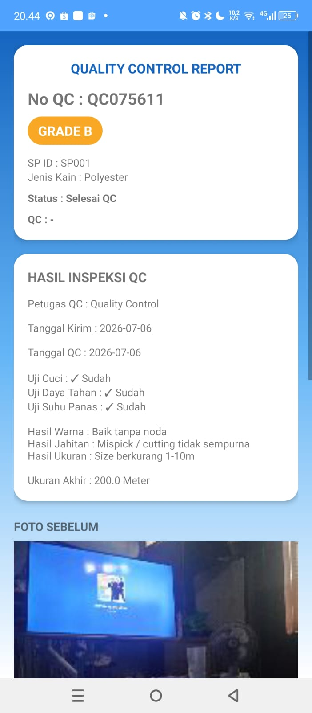

KELOMPOK 1
Nama Anggota dan bagian kerjanya:
-Alifa Halim Rasyidin 24552011300
Database SQLITE,
Desain semua tampilan from,
Penyempurnaan Kode fitur staffproduksi,kepalagudang,QC

-Arya Agustina 24552011303
Fitur utama staffproduksi
Fitur utama QC

-Mochamad Fajar Maulana 24552011322
Fitur Login
Fitur Kepala Gudang

# Deskripsi Aplikasi
Kami membuat aplikasi bernama TIASA produksi (Trisula Intergrated Advanced Support Application)
apk ini kami ambil berdasarkan tugas akhir pada bagian usulan pembuatan sistem pada matakuliah OOAD
dimana untuk membantu karyawan melakukan pencatatan Produksi
sebelumnya kami merivisi diagram Usecase kami menjadi seperti pada laporan OOAD 3.2.3

## Screenshot Aplikasi

### Login

### Register

### Dashboard Staff Produksi

### Dashboard Quality Control

### Dashboard Kepala Gudang

### Laporan Produksi

### Laporan Hasil Produksi

### Laporan QC

### Detail QC

Link Video Persentasi

https://youtu.be/UAmXBEwb5lI?si=rk9Y1BnDm-HDey2U

# Penjelasan cara penggunaan aplikasi

## Penting!
saat kami lakukan pengecekan terakhir kali ada beberapa bug
yg mohon maaf kami tidak tahu cara mengatasinya
1.Jika di Run langsung menggunakan API36 di beberapa device, sempat ada beberapa force close
saran kami jika ingin di run langsung menggunkanan API34 / install file Tiasa.APK

2.terdapat bug dimana jika device menggunakan mode gelap/darkmode
tulisan menjadi tidak jelas,jadi disarankan ubah menjadi light mode/mode terang
agar desain terlihat

## Alur
1.saat Login bisa menginputkan 3 akun bawaan dibawah:

akun = kepalagudang@tiasa.com
pass = kepalagudang123

akun = staffproduksi@tiasa.com
pass = staffproduksi123

akun = qualitycontrol@tiasa.com
pass = qualitycontrol123

2.atau bisa buat akun terlebih dahulu di register
dg mengklk tulisan Daftar Sekarang

untuk format uniknya
email harus @gmail.com
no hp diawali 08 dan terdiri dari 10-14angka

password terdiri dari kapital,simbol,angka
konfirmasi password harus sama

3.Saat pengecekan di rekomendasikan seperti berikut:
-login sebagai kepalagudang.
buka fitur buat surat perintah,isi data jenis kain,panjang,deadline.
untuk panjang kain minimal 100m dan maximal 300m,simpan dan konfirmasi

-logout dan login sebagai staffproduksi
buka fitur mulai produksi,klik card yg muncul
akan muncul detail sp dan input,panjang kain harus sama sesuai SP atau boleh melebihi toleransi 10M kemudian isi catatan dan simpan

buka fitur laporan hasil produksi dan klik tombol yg terletak di card,jika merah bearti belum dikirim ke QC dan jika hijau tandanya sudah berhasil dikirim ke QC

-logout dan login sebagai QC
buka fitur inpeksi,pilih card yg tersedia
chek box wajib di isi
pilih spinner pengecekan,setiap pilihan ini akan mempengaruhi grade kain
jika pilih 3 pengecekan pilihan pertama,maka hasilnya akan A
jika mayoritas pilihan ke2 maka hasilnya B
jika mayoritas pilihan ke3 maka hasilnya C

masukan panjang kain terakhir,ini tidak boleh melebihi panjang kain produksi/ harus dibawahnya

lalu klik tombol foto
dimana yg sebelum uji dan sesudah uji itu wajib di isi
dan yg tambahan itu opsional
jika semua sudah terisi maka simpan

kemudian buka fitur LaporanQC
bisa lalukan filter untuk memilh data
klik card yg ingin dilihat dan maka akan menampilkan data pengecekan

-logout dan kembali login ke kepalagudang
buka fitur lihat laporan produksi,disini akan muncul card hasil produksi
jika di klik maka akan menampilkan data yg melakukan produksi

buka fitur lihat laporan QC
disini akan menampilkan data laporan QC 
